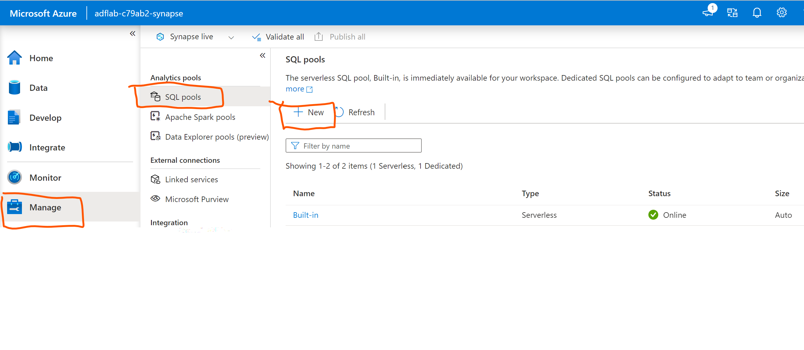

# Module 01 - Create a dedicated SQL pool in Azure Synapse Analytics Studio

[< Previous Module](../modules/module00.md) - **[Home](../README.md)** - [Next Module >](../modules/module02.md)

## :loudspeaker: Introduction

The Azure Synapse Studio is a one-stop-shop for all your data engineering and analytics development, from data exploration to data integration to large scale data analysis.

When planning your Microsoft dedicated SQL pool deployment using Azure Synapse, you first need to provision a Microsoft Synapse Workspace. Next, you will need to create dedicated SQL pool using the Azure Synapse Studio as described below.

## :thinking: Prerequisites

* An [Azure account](https://azure.microsoft.com/free/) with an active subscription.
* Your must have permissions to create resources in your Azure subscription.
* Your subscription must have the following resource providers registered: **Microsoft.Synapse**, **Microsoft.Storage**, and **Microsoft.EventHub**. Instructions on how to register a resource provider via the Azure Portal can be found [here](https://docs.microsoft.com/azure/azure-resource-manager/management/resource-providers-and-types#azure-portal).

## :dart: Objectives

* Create a dedicated SQL pool(data-warehouse) using Azure Synapse Studio.

## :bookmark_tabs: Table of Contents

| #  | Section | Role |
| --- | --- | --- |
| 1 | [Create a dedicated sql pool](#1-create-a-dedicated-sql-pool) | Azure Administrator |

<a href="#Module 01 - Create a dedicated SQL pool in Azure Synapse Analytics Studio">↥ back to top</a>

## 1. Create a dedicated sql pool in Synapse Studio

1. Sign in to the [Azure portal](https://portal.azure.com), navigate to the previously created Synapse workspace where the dedicated SQL pool will be created by typing the service name (or resource name directly) into the search bar.

      

2. From the list of workspaces, type the name (or part of the name) of the workspace to open. For this example, we'll use a workspace named adflab-(*i*randomid)-synapse. Click 'open' on the synapse studio box which will take you to the Synapse Studio.

    

3. On the Synapse Studio home page, navigate to the Management Hub in the left navigation by selecting the Manage icon.

    

    
4. Once in the Management Hub, navigate to the SQL pools section to see the current list of SQL pools that are available in the workspace. Select + New command and the new SQL pool create wizard will appear.

    

5. Enter the following details in the Basics tab:

| Setting	| Suggested value	| Description | 
| SQL pool name	| mySampleDataWarehouse 	| This is the name that the dedicated SQL pool will have. |
| Performance level	| DW1000c	| Set this to the smallest size to reduce costs for this quickstart. |

    

    

6. Wait several minutes while your deployment is in progress. Once complete, click **Go to resource**.

    

<a href="#module-01---create-a-microsoft-purview-account">↥ back to top</a>

## 2. Grant Access to Microsoft Purview's Data Plane

By default, the identity used to create the Microsoft Purview account resource will have full access to the Microsoft Purview Governance Portal. The following instructions detail how to provide access to additional users within your Azure Active Directory.

1. Navigate to your Microsoft Purview account and click the **Open Microsoft Purview Governance Portal** tile.

    

2. On the left-hand side, navigate to **Data map**.

    

3. Select **Collections**.

    

4. Select **Role assignments**.

    

5. On the right-hand side of **Data curators**, click the **Add** icon.

    

6. Search for another user within your Azure Active Directory, select their account, click **OK**.

    

    > :bulb: **Did you know?**
    >
    > Microsoft Purview has a set of predefined data plane roles that can be used to control who can access what.
    >
    > For more information, check out [Access control in Microsoft Purview](https://docs.microsoft.com/azure/purview/catalog-permissions).

    | Role  | Collections | Catalog | Sources/Scans | Description |
    | --- | --- | --- | --- | --- |
    | Collection Admin | `Read/Write` | | | Manage collections and role assignments. |
    | Data Reader ||  `Read` |  | Access to catalog (read only). |
    | Data Curator || `Read/Write` |  | Access to catalog (read & write). |
    | Data Source Admin |  || `Read/Write` | Manage data sources and data scans. |

<a href="#module-01---create-a-microsoft-purview-account">↥ back to top</a>

## :mortar_board: Knowledge Check

[https://aka.ms/purviewlab/q01](https://aka.ms/purviewlab/q01)

1. Which of the following Microsoft Purview pricing meters is **serverless** and used to support **data map population** through scanning and ingestion jobs?

    A ) Capacity Units  
    B ) vCore Hours  
    C ) Neither

2. Which of the following Microsoft Purview pricing meters is **always on** and used to support **data map consumption** through capacity and storage?

    A ) Capacity Units  
    B ) vCore Hours  
    C ) Neither

3. Which Microsoft Purview **feature** is included and billed with the consumption of the **data map**?

    A ) Data Estate Insights  
    B ) Search and browse of data assets  
    C ) SQL DevOps access

4. Which predefined Microsoft Purview role provides access to **manage data sources**?

    A ) Purview Data Reader  
    B ) Purview Data Curator  
    C ) Purview Data Source Administrator

<a href="#module-01---create-a-microsoft-purview-account">↥ back to top</a>

## :tada: Summary

This module provided an overview of how to provision a Microsoft Purview account using the Azure Portal and how to grant the appropriate level of access to Microsoft Purview's data plane.

[Continue >](../modules/module02a.md)
