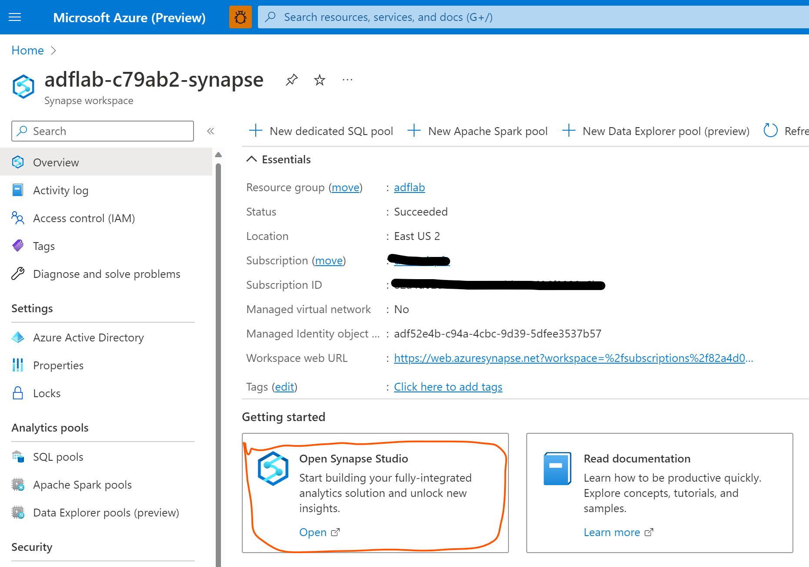
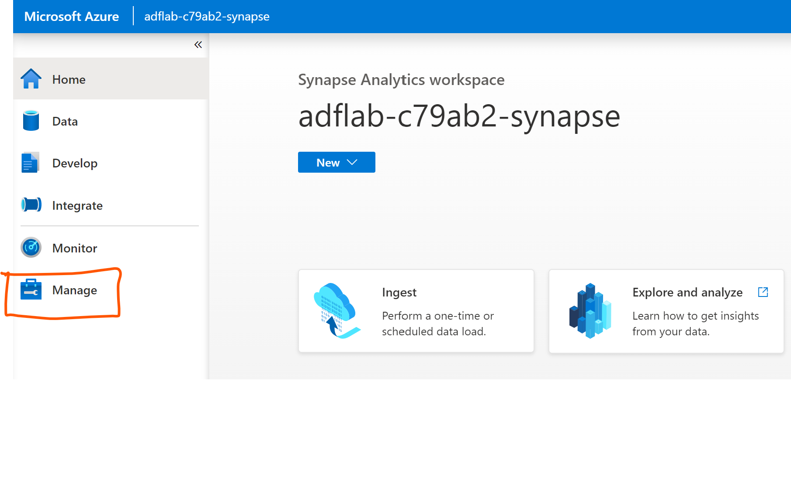
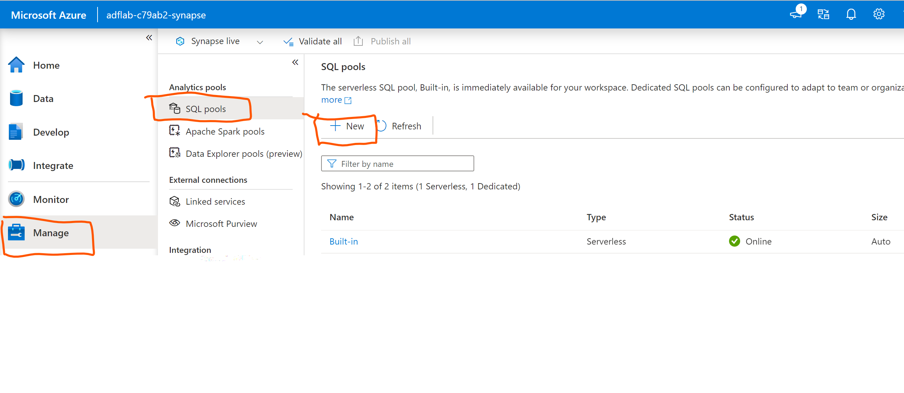
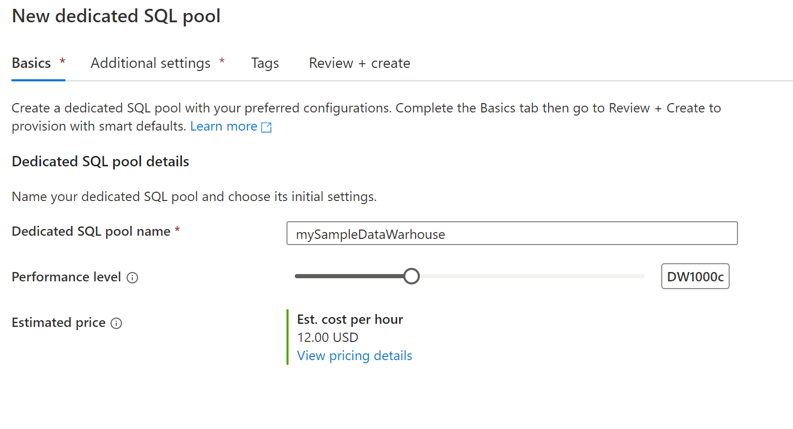
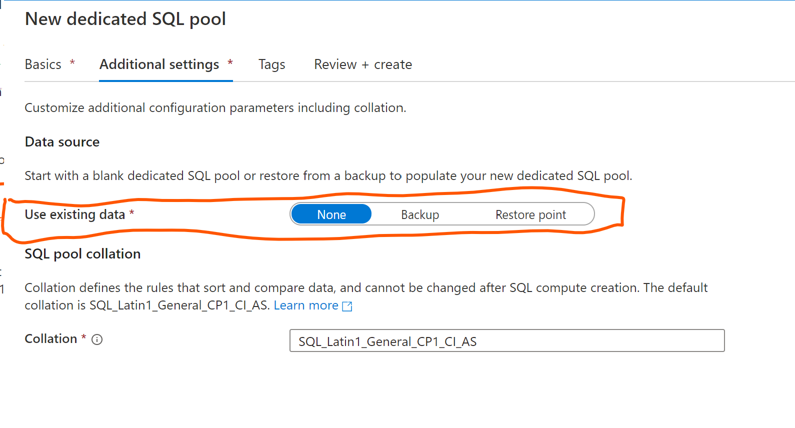
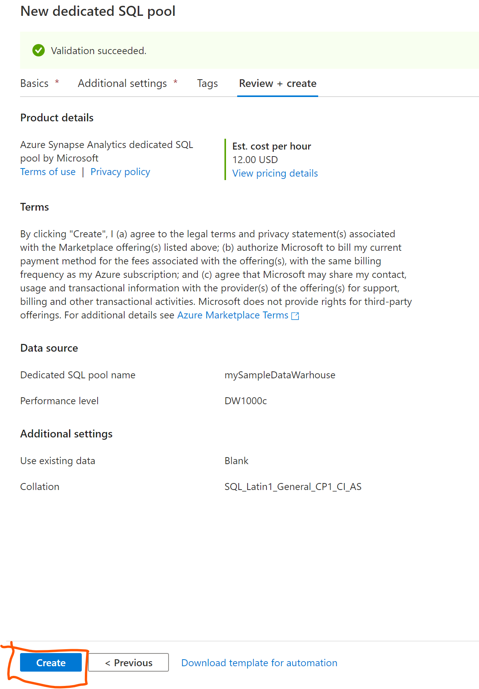

# Module 01 - Create a dedicated SQL pool in Azure Synapse Analytics Studio

[< Previous Module](../modules/module00.md) - **[Home](../README.md)** - [Next Module >](../modules/module02.md)

## :loudspeaker: Introduction

The Azure Synapse Studio is a one-stop-shop for all your data engineering and analytics development, from data exploration to data integration to large scale data analysis.

When planning your Microsoft dedicated SQL pool deployment using Azure Synapse, you first need to provision a Microsoft Synapse Workspace. Next, you will need to create dedicated SQL pool using the Azure Synapse Studio as described below.

## :thinking: Prerequisites

* An [Azure account](https://azure.microsoft.com/free/) with an active subscription.
* Your must have permissions to create resources in your Azure subscription.
* Your subscription must have the following resource providers registered: **Microsoft.Synapse**, **Microsoft.Storage**, and **Microsoft.EventHub**. Instructions on how to register a resource provider via the Azure Portal can be found [here](https://docs.microsoft.com/azure/azure-resource-manager/management/resource-providers-and-types#azure-portal).

## :dart: Objectives

* Create a dedicated SQL pool(data-warehouse) using Azure Synapse Studio.

## :bookmark_tabs: Table of Contents

| #  | Section | Role |
| --- | --- | --- |
| 1 | [Create a dedicated sql pool](#1-create-a-dedicated-sql-pool) | Azure Administrator |

## 1. Create a dedicated sql pool in Synapse Studio

1. Sign in to the [Azure portal](https://portal.azure.com), navigate to the previously created Synapse workspace where the dedicated SQL pool will be created by typing the service name (or resource name directly) into the search bar.

     

2. From the list of workspaces, type the name (or part of the name) of the workspace to open. For this example, we'll use a workspace named adflab-(*i*randomid)-synapse. Click 'open' on the synapse studio box which will take you to the Synapse Studio.

    

3. On the Synapse Studio home page, navigate to the Management Hub in the left navigation by selecting the Manage icon.

    

    
4. Once in the Management Hub, navigate to the SQL pools section to see the current list of SQL pools that are available in the workspace. Select + New command and the new SQL pool create wizard will appear.

    

5. Enter the following details in the Basics tab:

| #  | Setting | Suggested value | Description |
| --- | --- | --- | --- |
| 1 | SQL pool name | mySampleDataWarehouse | This is the name that the dedicated SQL pool will have |
| 2 | Performance level | DW1000c | Set this to the indicated size to provide the optimal performance for the Lab |

    

6. In the next tab, Additional settings, select none to provision the SQL pool without data. Leave the default collation as selected.
If you want to restore your dedicated SQL pool from a restore point, select Restore point. For more information on how to perform a restore, see [How-to: Restore an existing dedicated SQL pool](https://learn.microsoft.com/en-us/azure/synapse-analytics/backuprestore/restore-sql-pool)

   

7. We won't add any tags for now, so next select Review + create. In the Review + create tab, make sure that the details look correct based on what was previously entered, and press create.

    
    

8. At this point, the resource provisioning flow will start. After the provisioning completes, navigating back to the workspace will show a new entry for the newly created SQL pool.

## :tada: Summary

Here you have just created the dedicated SQL pool; now it will be available in the workspace for loading data, processing streams, reading from the azure data lake, etc.

[Continue >](../modules/module01a.md)
