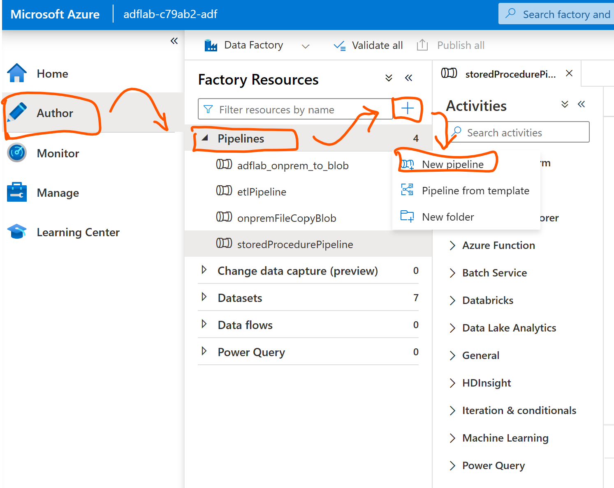
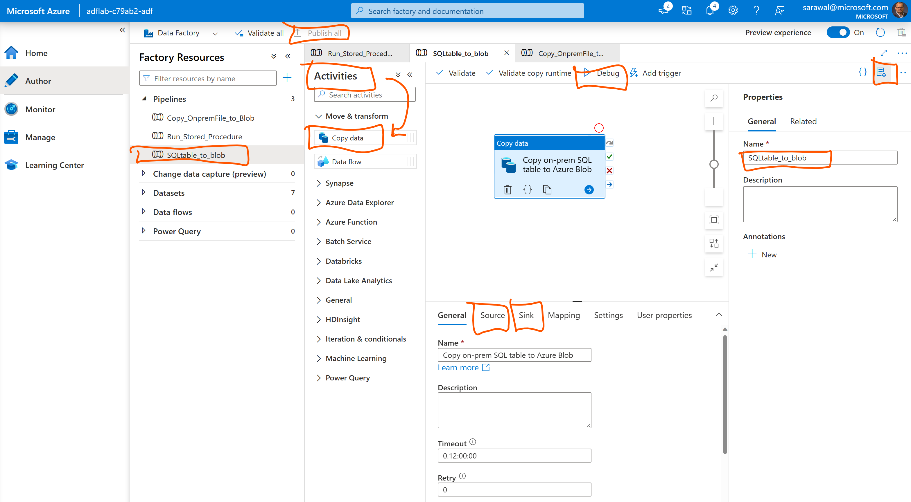
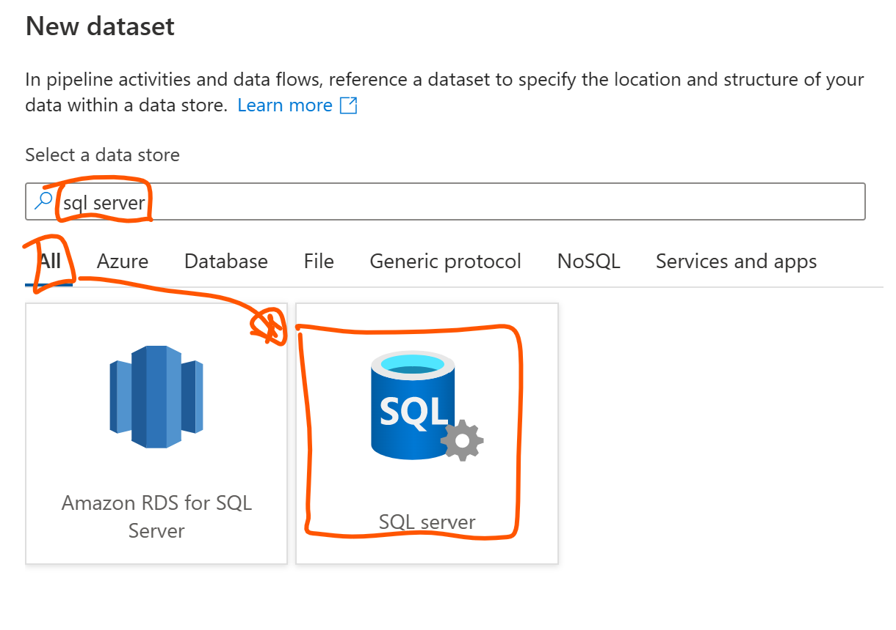
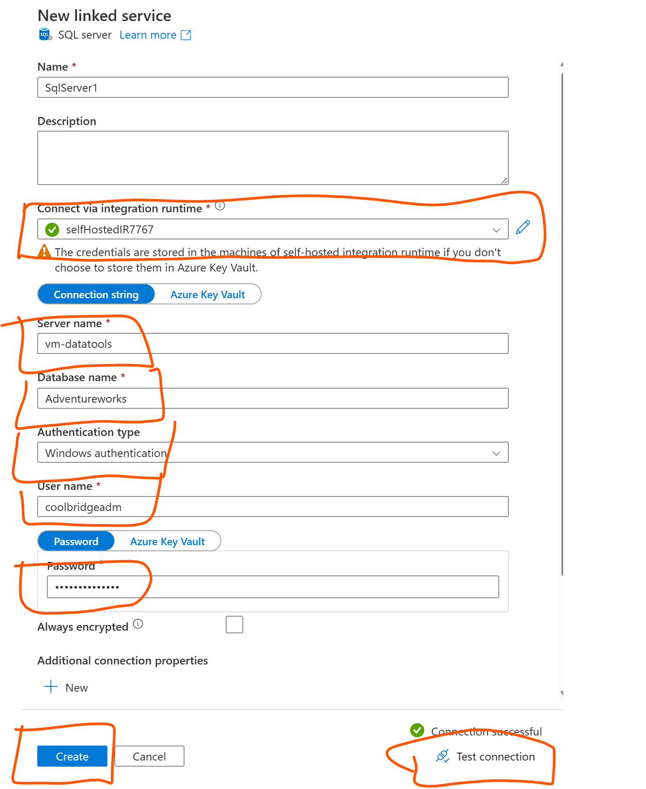
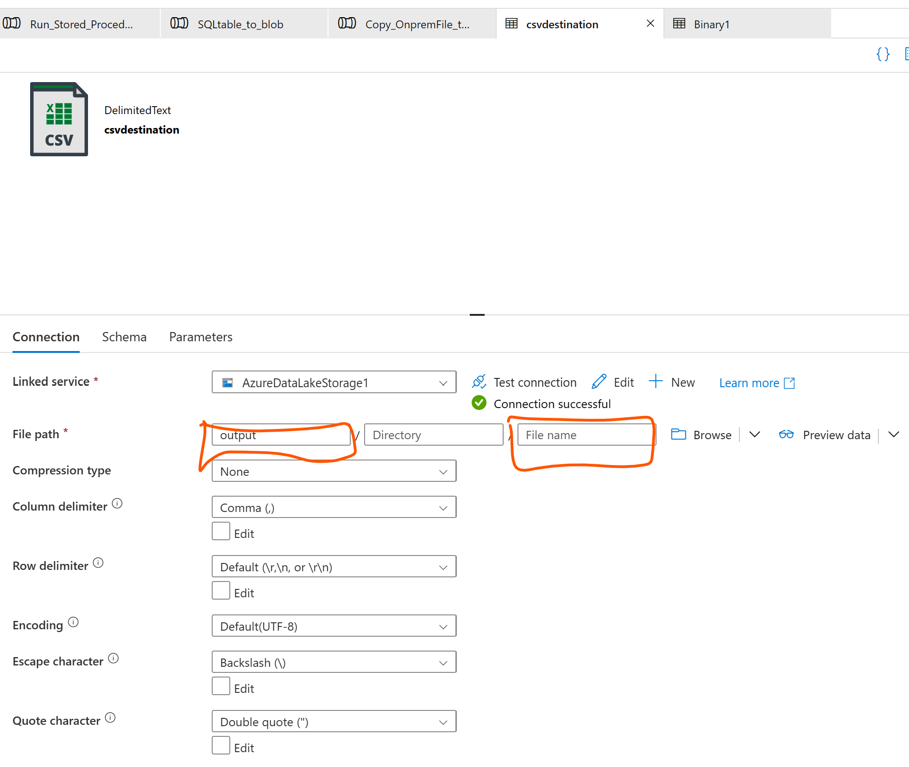
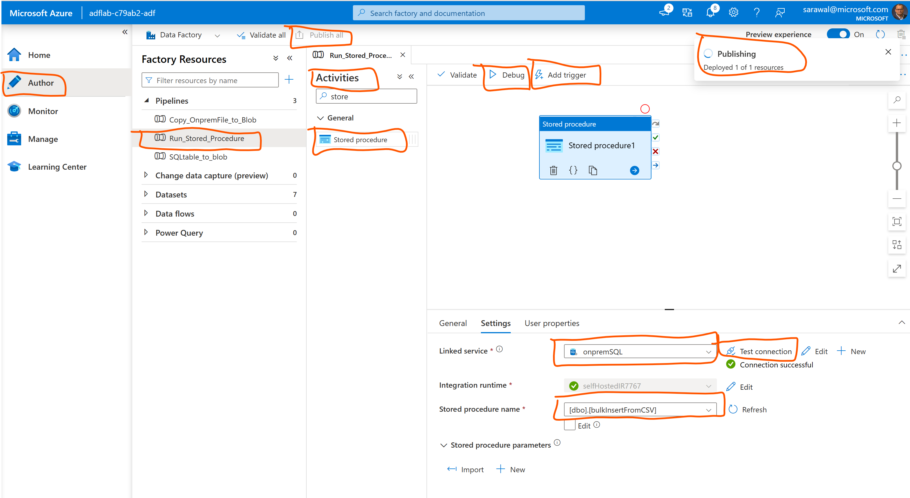

# Module 04: Create self-hosted integration runtime within ADF

[< Previous Module](../modules/module03.md) - **[Home](../README.md)** - [Next Module >](../modules/module05.md)

## :loudspeaker: Introduction

In this lab, we will be provisioning Azure VM with self-hosted integration runtime pre-installed to run data factory tasks
and interact with on-prem environment. For the purpose of simulation, we are going to use existing virtual network that you previously created in the "adflab" resource group, i.e. virtual network with the name like adflab-{******}-vnet

## :thinking: Prerequisites

* An [Azure account](https://azure.microsoft.com/free/) with an active subscription.

* Data Factory. The integration runtime is created in the data factory(previosly created). If you don't have a data factory, see the [Create Data Factory](https://learn.microsoft.com/en-us/azure/data-factory/v1/data-factory-move-data-between-onprem-and-cloud#create-data-factory) for steps to create one.

* Virtual Network. The virtual machine will join this VNET. If you don't have one, use this tutorial, see [Create virtual network](https://learn.microsoft.com/en-us/azure/virtual-network/quick-create-portal#create-a-virtual-network) to create one.

## Creating and configuring a Self-hosted integration Runtime on Azure VMs

Handshake of self-hosted integration runtime in your machine is achieved by copying the key provided during the 'Self-Hosted' Integration runtime setup from Azure Data Factory and then adding it to the Authentication Key field during registration of Self-Hosted IR in your local machine, please follow the instructions provided below.

Use the following steps to create a self-hosted IR using the Azure Data Factory


1. On the home page of the Azure Data Factory UI, select the Manage tab from the leftmost pane.

2. Select Integration runtimes on the left pane, and then select +New.

    

3. On the Integration runtime setup page, select Azure, Self-Hosted, and then select Continue.

4. On the following page, select Self-Hosted to create a Self-Hosted IR, and then select Continue. 

    

## Configure a self-hosted IR via UI

1. Enter a name for your IR, and select Create.

2. On the Integration runtime setup page, select the link under Option 1 to open the express setup on your computer. Or follow the steps under Option 2 to set up manually. The following instructions are based on manual setup:

    

	(a) Copy and paste the authentication key. Select Download and install integration runtime.

	(b) Download the self-hosted integration runtime on a local Windows machine. Run the installer.

	(c) On the Register Integration Runtime (Self-hosted) page, paste the key you saved earlier, and select Register.

    

    (d) On the New Integration Runtime (Self-hosted) Node page, select Finish.

    After the self-hosted integration runtime is registered successfully, you see the following window:

    

## Using the Self Hosted Runtime Integration 

Self hosted runtime integration is used to copy data from on-prem environment to azure cloud. You could use your local machine or the host computer(ADPDesktop) for these labs.

On this lab section we will perform the below three tasks: 

| Linked Service  | Dataset                               | Location |
|:--------------- |:------------------------------------- |:----------- |
| onpremSQLServer | AdventureWorks.Sales.SalesOrderDetail | on-prem |
| AzureBlobStorage| File path - output/Directory/orderdetail.txt | azure cloud |
| FileServer      | onprem-file (demodata.csv)            | on-prem |  


## **(a)** Read data from on-prem SQL table and push to azure blob storage  

Assumption: The AdventureWorks database is installed in your local machine. We will be moving data from one of the tables to the Azure blob store.

**1.** On the Azure Data Factory portal, click on the Author tab on the left pane - click on the three dots next to the pipeline menu and click 'New pipeline'. Give the name  'SQLtable_to_blob' of the pipeline



**2.** In the **Activities toolbox**, expand **Move & Transform**. Drag the **Copy Data** activity from the Activities toolbox to the pipeline designer surface. You can also search for activities in the Ativities toolbox. Specify **SQLtable_to_blob** for name



**3.**  Go to the Source tab. Select + New to create a source dataset.

**4.** In the New Dataset dialog box, select SQL Server to copy data from desired/selected table, and then select Continue.



**5.** Provide 'onpremSQLLinkedServer' for the name of the linked service to be created and on the drop down Linked Service - click new. You will now be creating a new linked service using the newly created self-hosted integration runtime to link up to on-prem SQL server. Provide the host machine details where your self-hosted runtime integration agent is installed and click on 'Test connection' - if all the parameters are correct, you  should see 'Connection successful' message as shown in the image below. 




**6.** Next you will click on +New to provide the source dataset - choose onpremSQLLinkedServer as the Linked service and for the table name choose 'Sales.SalesOrderDetail' from the adventureworks database. (You can choose any other available database and table if you like!). Choose 'From connection/store' for Import schema. Then click 'OK'.


**7.** Now go to the Sink tab, and select + New to create a sink dataset. In the New Dataset dialog box, choose the 'Azure Blob Storage', and then select Continue.


**8.** In the New Linked Service (Azure Blob Storage) dialog box, enter 'AzureStorageLinkedService' as name, select your storage account from the Storage account name list. Test connection, select Create to deploy the linked service.


**9.** After the linked service is created, it’s navigated back to the Set properties page. Next to File path, select Browse. Navigate to the adflab-*prefix*-storage/output folder(created previously), leave the file field empty for the destination file, and then select OK.




**10.** Go back to the pipeline now and click 'Debug' to quickly run the pipeline. You should see the new flat file created on the blob storage corresponding to the on-prem SQL table. 


## **(b)** Copy files from on-prem to azure blob storage
For this lab, we will copy demodata.csv located in your local machine(downloaded from github repo) to the Azure Blob Storage using ADF.

Use the process described above to create source (File System) and sink (Azure Blob Storage) using the self-hosted IR, and run the pipeline clicking on the 'Debug'. After successful completion of the pipeline run, you should see the new copied file in Azure Blob Storage. 


## **(c)** running stored procedure on the on-prem sql using self hosted IR as alternate way of performing complex ETL

**1.** On your hostmachine, run the below script in *SQL Server Management Studio(SSMS)* after ensuring you have downloaded the demodata.csv file from the data folder in this github repository. Use any test database such as adventureworks or contoso.

```sql
USE [Testing] --desired database

--create schema
CREATE TABLE employeeData(
	first_name [nvarchar](55) NULL,
	last_name [nvarchar](55) NULL,
	email [nvarchar](100) NULL,
	phone_number [nvarchar](55) NULL,
	hire_date date NULL,
	salary float
) 
GO

-- create procedure to run from ADF
create procedure bulkInsertFromCSV
  as
  BULK INSERT employeedata
FROM 'F:\browserDownloads\adflab-main\data\demodata.csv' --provide the correct path from the github downloaded file in local machine
WITH (FIRSTROW = 2,
    FIELDTERMINATOR = ',',
    ROWTERMINATOR='\n',
    BATCHSIZE=250000,
    MAXERRORS=2);
go
```

**2.** Create a new pipeline 'Run_Stored_Procedure' and drag **Stored Procedure** activity into the canvas.

**3.** On **Settings** tab, click on drop-down Linked service to select onpremSQLLinkedServer (previously created). You can verify this linked service to be working by clicking on the 'Test Connection. 

**4.** On the Stored procedure name, click on the drop-down menu to select 'bulkInsertFromCSV' procedure from the list of procedures.




**5.** Click 'Trigger now' under Add trigger option on top of the authoring canvas. Then click 'OK' on the parameters dialog box. 

**6.** Go to the **Monitor** tab on the left pane in data factory portal to see the activity runs of your pipeline. Verify that the executed stored procedure within the on-prem SQL Server environment to copy csv data into the empty table created above using Azure Data Factory is succeeded. 


## :tada: Summary

This module provided an overview of how to interact with Azure Data Factory and Self-hosted Integration runtime to migrate a lot of your on-prem data assets to Azure Blob Storage or other clouds with little to no codes involved. You also reviewed how to execute SQL procedure directly from Azure Data Factory.


[Continue >](../modules/module05.md)
