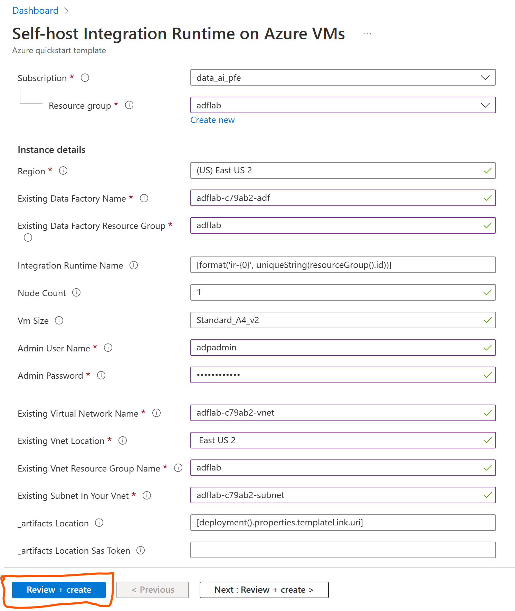
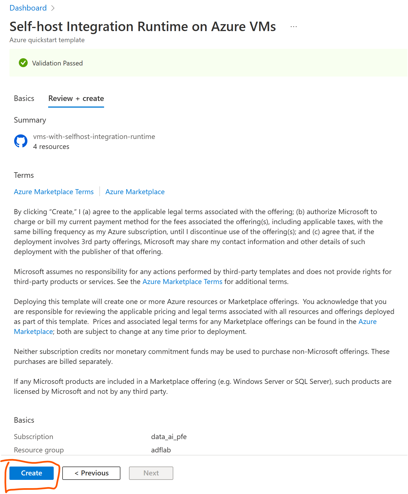

# Module 04 - Module04: Create self-hosted integration runtime within ADF

[< Previous Module](../modules/module03.md) - **[Home](../README.md)** - [Next Module >](../modules/module05.md)

## :loudspeaker: Introduction

In this lab, we will be provisioning Azure VM with self-hosted integration runtime pre-installed to run data factory tasks
and interact with on-prem environment. For the purpose of simulation, we are going to use existing virtual network that you previously created in the "adflab" resource group, i.e. virtual network with the name like adflab-{******}-vnet

## :thinking: Prerequisites

* An [Azure account](https://azure.microsoft.com/free/) with an active subscription.

* Data Factory. The integration runtime is created in the data factory(previosly created). If you don't have a data factory, see the [Create Data Factory](https://learn.microsoft.com/en-us/azure/data-factory/v1/data-factory-move-data-between-onprem-and-cloud#create-data-factory) for steps to create one.

* Virtual Network. The virtual machine will join this VNET. If you don't have one, use this tutorial, see [Create virtual network](https://learn.microsoft.com/en-us/azure/virtual-network/quick-create-portal#create-a-virtual-network) to create one.

## Setting up Self-host integration Runtime on Azure VMs

 1. To create your own self-hosted integration runtime in your host computer you can download it by [clicking here](https://learn.microsoft.com/en-us/azure/data-factory/create-self-hosted-integration-runtime?tabs=data-factory#install-and-register-self-hosted-ir-from-download-center)

 2. Handshake of self-hosted integration runtime in your machine is achieved by copying the key provided during the 'Self-Hosted' Integration runtime setup from Azure Data Factory and then adding it to the Authentication Key field during registration of Self-Hosted IR, please follow the instructions provided in the link above.

## OPTIONAL:

## :test_tube: Lab Environment Setup for provisioning an Azure VM with Self-host integration runtime 

1. Right-click or `Ctrl + click` the button below to open the Azure Portal in a new window.

    

   
 

2. Beneath the **Resource group** field, click **Create new** and provide the existing resource name (e.g. `adflab-rg`), select a [valid location](https://azure.microsoft.com/global-infrastructure/services/?products=ADF&regions=all) (e.g. `Central US`), and then click **Review + create**.

    

3. Once the validation has passed, click **Create**.

    

4. The deployment should take approximately 3 minutes to complete. Once you see the message **Your deployment is complete**, click **Go to resource group**.

When you deploy this Azure Resource Template, you will create a logical selfhost IR in your data factory and the following resources

* Azure Virtual Machine
* Azure Storage (for VM system image and boot diagnostic)
* Public IP Address
* Network Interface
* Network Security Group
* This template can help you create self-hosted IR and make it workable in azure VMs. The VM must join in an existing VNET.

[Continue >](../modules/module05.md)
