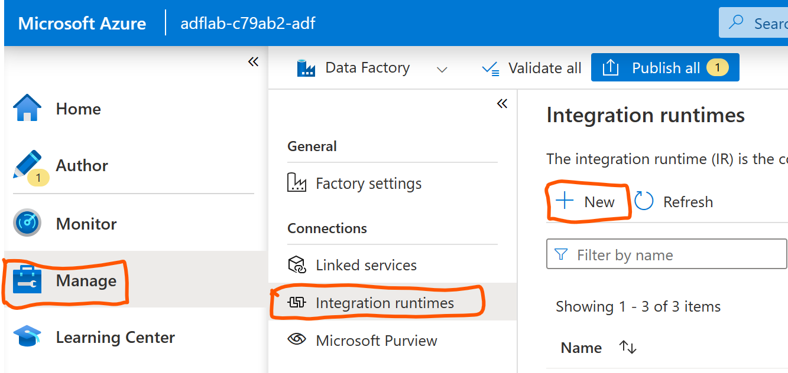
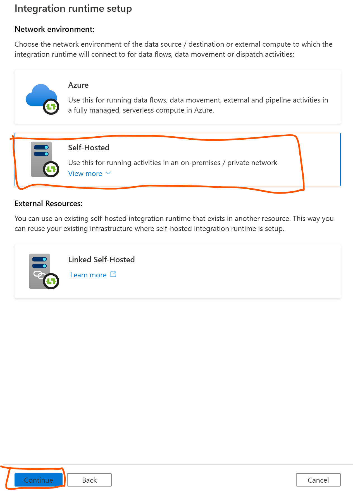
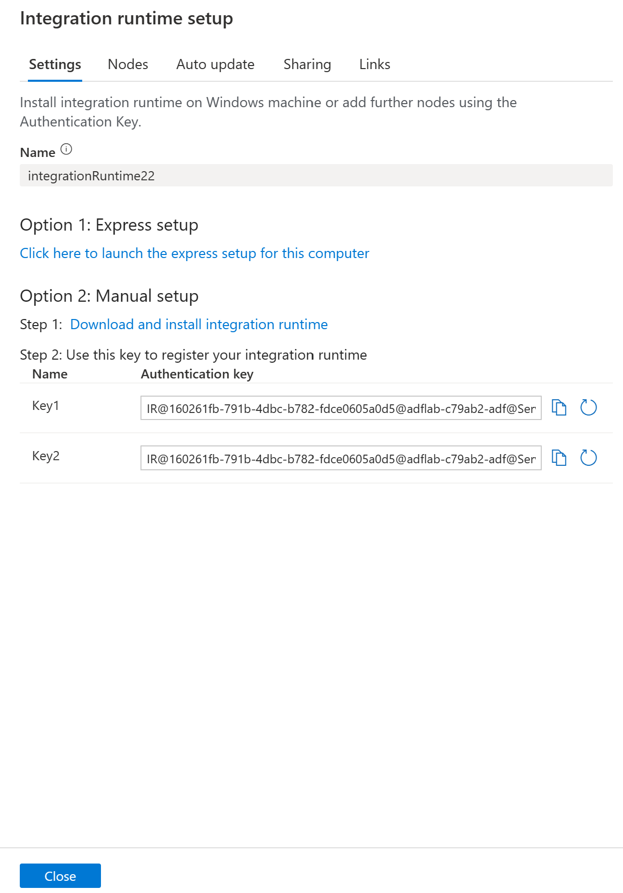
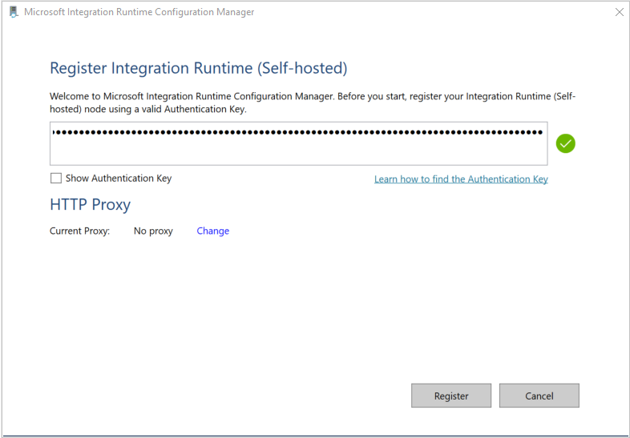
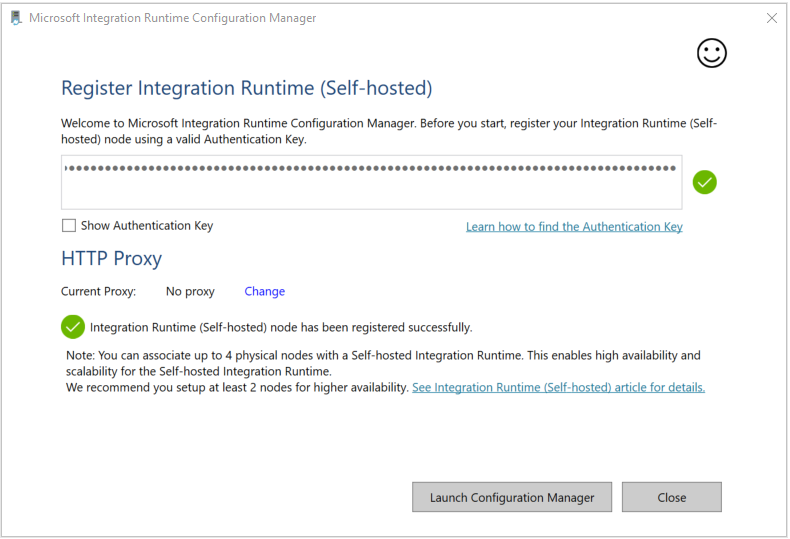

# Module 04: Create self-hosted integration runtime within ADF

[< Previous Module](../modules/module03.md) - **[Home](../README.md)** - [Next Module >](../modules/module05.md)

## :loudspeaker: Introduction

In this lab, we will be provisioning Azure VM with self-hosted integration runtime pre-installed to run data factory tasks
and interact with on-prem environment. For the purpose of simulation, we are going to use existing virtual network that you previously created in the "adflab" resource group, i.e. virtual network with the name like adflab-{******}-vnet

## :thinking: Prerequisites

* An [Azure account](https://azure.microsoft.com/free/) with an active subscription.

* Data Factory. The integration runtime is created in the data factory(previosly created). If you don't have a data factory, see the [Create Data Factory](https://learn.microsoft.com/en-us/azure/data-factory/v1/data-factory-move-data-between-onprem-and-cloud#create-data-factory) for steps to create one.

* Virtual Network. The virtual machine will join this VNET. If you don't have one, use this tutorial, see [Create virtual network](https://learn.microsoft.com/en-us/azure/virtual-network/quick-create-portal#create-a-virtual-network) to create one.

## Creating and configuring a Self-hosted integration Runtime on Azure VMs

Handshake of self-hosted integration runtime in your machine is achieved by copying the key provided during the 'Self-Hosted' Integration runtime setup from Azure Data Factory and then adding it to the Authentication Key field during registration of Self-Hosted IR in your local machine, please follow the instructions provided below.

Use the following steps to create a self-hosted IR using the Azure Data Factory


1. On the home page of the Azure Data Factory UI, select the Manage tab from the leftmost pane.

2. Select Integration runtimes on the left pane, and then select +New.

    

3. On the Integration runtime setup page, select Azure, Self-Hosted, and then select Continue.

4. On the following page, select Self-Hosted to create a Self-Hosted IR, and then select Continue. 

    

## Configure a self-hosted IR via UI

1. Enter a name for your IR, and select Create.

2. On the Integration runtime setup page, select the link under Option 1 to open the express setup on your computer. Or follow the steps under Option 2 to set up manually. The following instructions are based on manual setup:

    

	(a) Copy and paste the authentication key. Select Download and install integration runtime.

	(b) Download the self-hosted integration runtime on a local Windows machine. Run the installer.

	(c) On the Register Integration Runtime (Self-hosted) page, paste the key you saved earlier, and select Register.

    

    (d) On the New Integration Runtime (Self-hosted) Node page, select Finish.

    After the self-hosted integration runtime is registered successfully, you see the following window:

    

## Using the Self Hosted Runtime Integration 

Self hosted runtime integration is used to copy data from on-prem environment to azure cloud. You could use your local machine or the host computer(ADPDesktop) for these labs.

On this lab section we will perform the below three tasks: 

| Linked Service  | Dataset                               | Location |
|:--------------- |:------------------------------------- |:----------- |
| onpremSQLServer | AdventureWorks.Sales.SalesOrderDetail | on-prem |
| AzureBlobStorage| File path - output/Directory/orderdetail.txt | azure cloud |
| FileServer      | onprem-file (demodata.csv)            | on-prem |

a) Read data from on-prem SQL table and push to azure blob storage
Assumption: The AdventureWorks database is installed in your local machine. We will be moving data from one of the tables to the Azure blob store.

b) Copy files from on-prem to azure blob storage
For this lab, we will copy demodata.csv located in your local machine to the Azure Blob Storage using ADF.

c) running stored procedure on the onp-rem sql using self hosted IR as alternate way of performing complex ETL

On your hostmachine, run the below script in SQL Server Management Studio(SSMS) after ensuring you have downloaded the demodata.csv file from the data folder in this github repository. Use any test database such as adventureworks or contoso.

```sql
USE [Testing] --desired database

--create schema
CREATE TABLE employeeData(
	first_name [nvarchar](55) NULL,
	last_name [nvarchar](55) NULL,
	email [nvarchar](100) NULL,
	phone_number [nvarchar](55) NULL,
	hire_date date NULL,
	salary float
) 
GO

-- create procedure to run from ADF
create procedure bulkInsertFromCSV
  as
  BULK INSERT employeedata
FROM 'F:\browserDownloads\adflab-main\data\demodata.csv' --provide the correct path from the github downloaded file in local machine
WITH (FIRSTROW = 2,
    FIELDTERMINATOR = ',',
    ROWTERMINATOR='\n',
    BATCHSIZE=250000,
    MAXERRORS=2);
go
```


[Continue >](../modules/module05.md)
