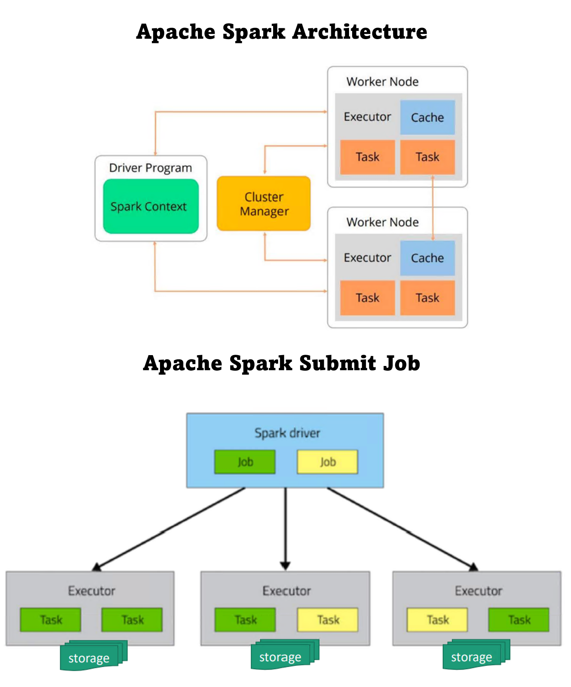

# Module 05: Synapse - dedicated spark pool

[< Previous Module](../modules/module04.md) - **[Home](../README.md)** - [Next Module >](../modules/module00.md)

## :loudspeaker: Introduction

A Spark pool is a set of metadata that defines the compute resource requirements and associated behavior characteristics when a Spark instance is instantiated. These characteristics include but aren't limited to name, number of nodes, node size, scaling behavior, and time to live. A Spark pool in itself doesn't consume any resources. There are no costs incurred with creating Spark pools. Charges are only incurred once a Spark job is executed on the target Spark pool and the Spark instance is instantiated on demand.

Azure Synapse Workspace provides the feature to provision Spark pool as PaaS based model. Spark consists of unique architecture that leverages in-memory processing that is based on the jobs submitted to the spark. Below you will see the architecture and how jobs are submitted and processed. 

You will be creating a spark pool in this lab module, for reference you can also check out Microsoft Learning on [Creating Spark Pool](https://learn.microsoft.com/en-us/azure/synapse-analytics/quickstart-create-apache-spark-pool-portal) 

## Creating Apache Spark Pool in Azure Synapse Workspace

1. 

## :tada: Summary

This module provided an overview of how to create Apache Apark pool in Azure Synapse Analytics workspace.

[Continue >](../modules/module00.md)
