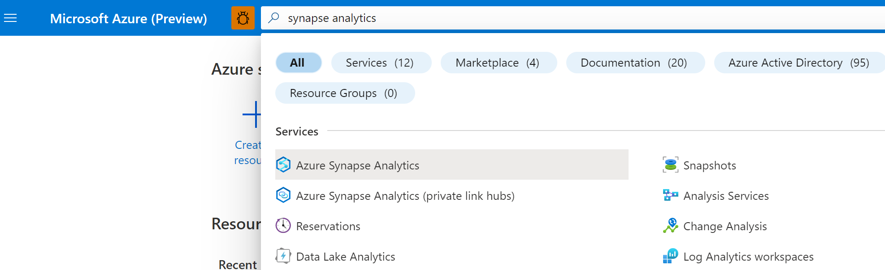
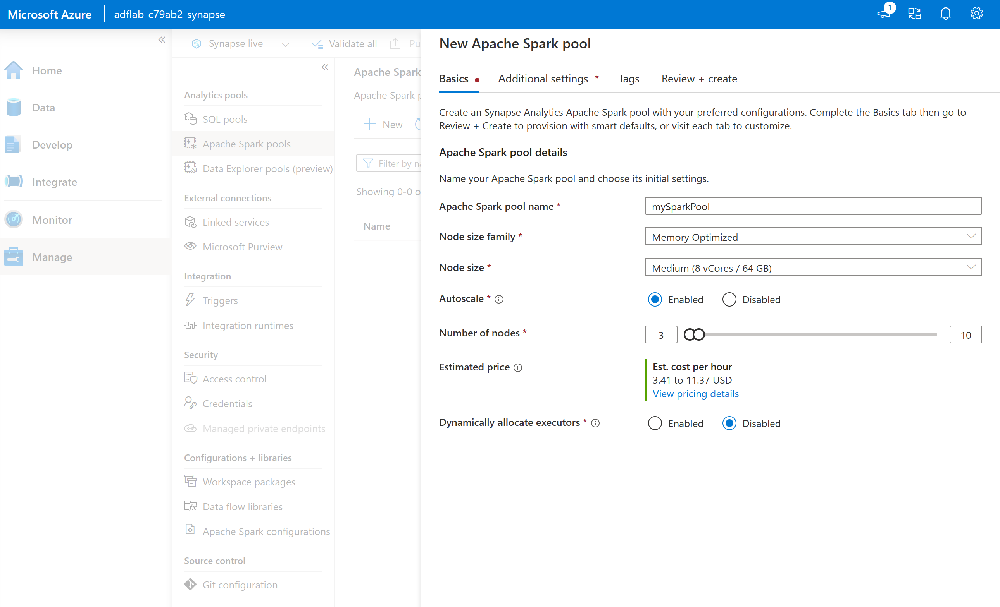
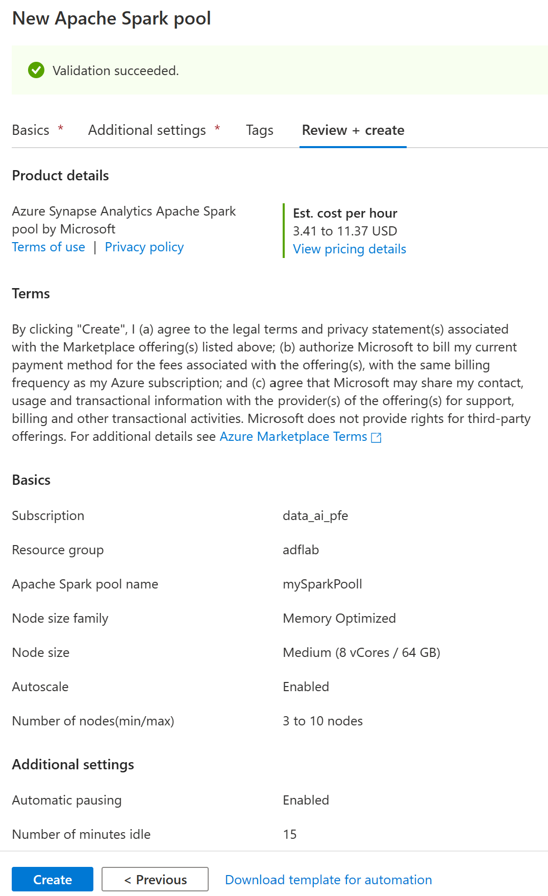
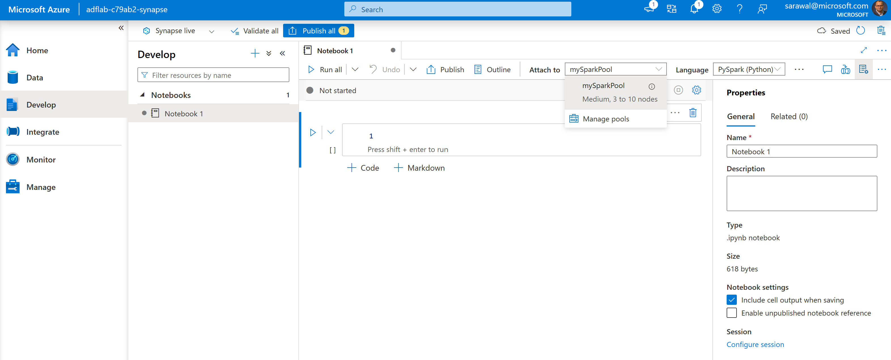

# Module 05: Synapse - dedicated spark pool

[< Previous Module](../modules/module04.md) - **[Home](../README.md)** - [Next Module >](../modules/module00.md)

## :loudspeaker: Introduction

A Spark pool is a set of metadata that defines the compute resource requirements and associated behavior characteristics when a Spark instance is instantiated. These characteristics include but aren't limited to name, number of nodes, node size, scaling behavior, and time to live. A Spark pool in itself doesn't consume any resources. There are no costs incurred with creating Spark pools. Charges are only incurred once a Spark job is executed on the target Spark pool and the Spark instance is instantiated on demand.

Azure Synapse Workspace provides the feature to provision Spark pool as PaaS based model. Spark consists of unique architecture that leverages in-memory processing that is based on the jobs submitted to the spark. Below you will see the architecture and how jobs are submitted and processed. 

You will be creating a spark pool in this lab module, for reference you can also check out Microsoft Learning on [Creating Spark Pool](https://learn.microsoft.com/en-us/azure/synapse-analytics/quickstart-create-apache-spark-pool-portal) 

## Creating Apache Spark Pool in Azure Synapse Workspace

1. Sign in to the [Azure portal](https://portal.azure.com), navigate to the previously created Synapse workspace where the dedicated SQL pool will be created by typing the service name (or resource name directly) into the search bar.

     

2. From the list of workspaces, type the name (or part of the name) of the workspace to open. For this example, we'll use a workspace named adflab-(*i*randomid)-synapse. Click 'open' on the synapse studio box which will take you to the Synapse Studio.

    

3. On the Synapse Studio home page, navigate to the Management Hub in the left navigation by selecting the Manage icon.

    

    
4. Once in the Management Hub, navigate to the 'Apache Spark pools' section to see the current list of spark pools that are available in the workspace. Select + New command and the new Apache Spark pool create wizard will appear.

    

5. Enter 'mySparkPool' for the spark pool name and accept all the defaults in the Basics tab; click on 'Review and Create'. After the successful validation check, click on 'Create' button.

    

6. Once the Spark Pool is proisioned, you will now create a spark notebook. Click on 'Develop' in the left most pane, click on '+' and select 'Notebook'. Select the spark pool just created(mySparkPool) on the 'Attach to' drop down  menu as shown in the image below:

    

## :tada: Summary

This module provided an overview of how to create Apache Spark pool in Azure Synapse Analytics workspace. You also reviewed how to create a notebook and attach it to the Spark pool.

[Continue >](../modules/module00.md)
